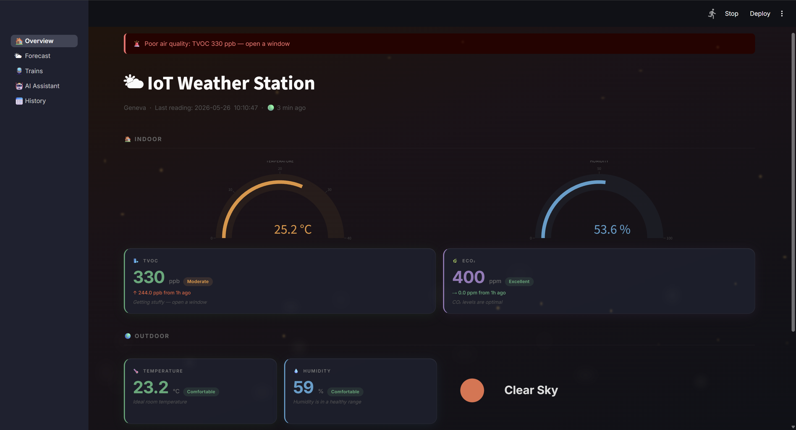
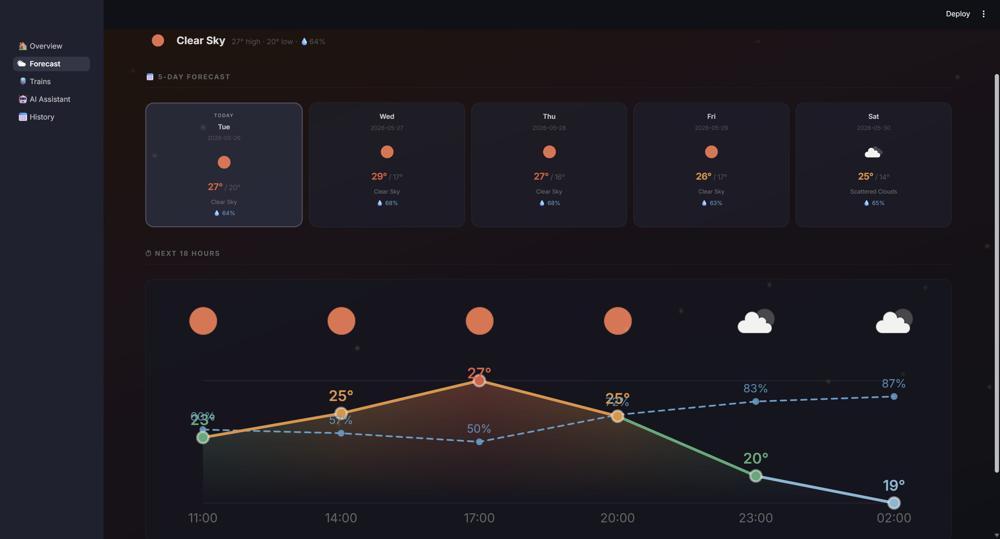
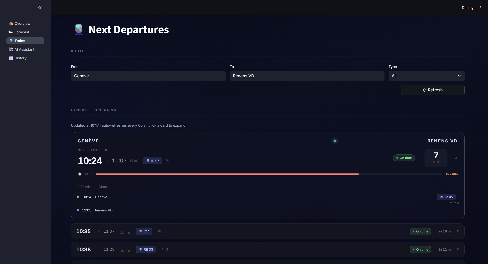
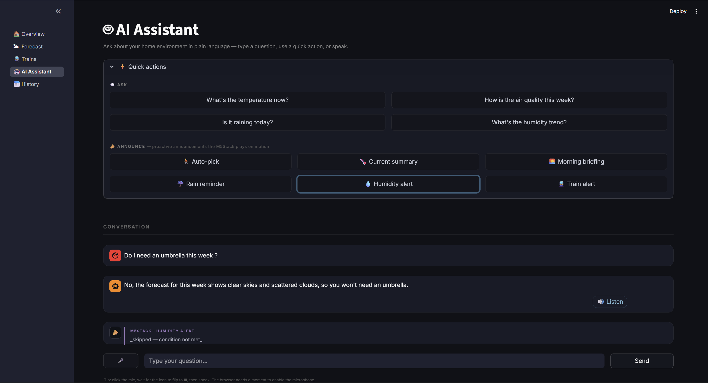
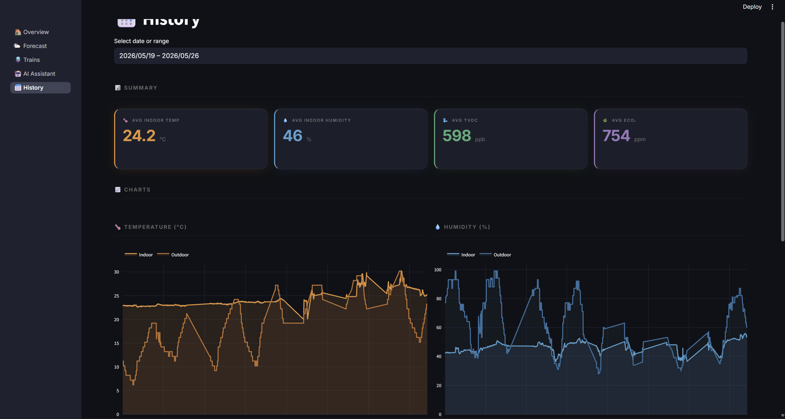
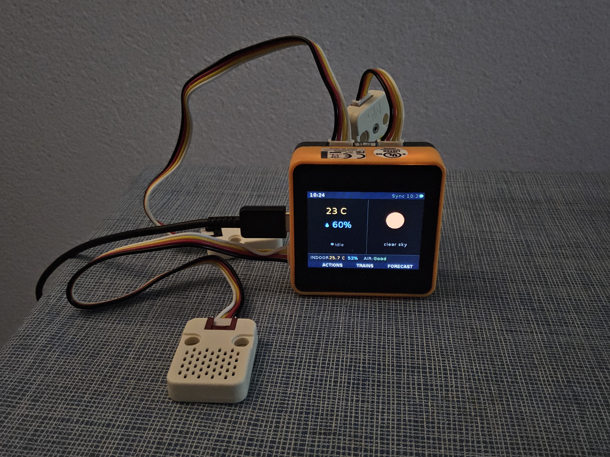
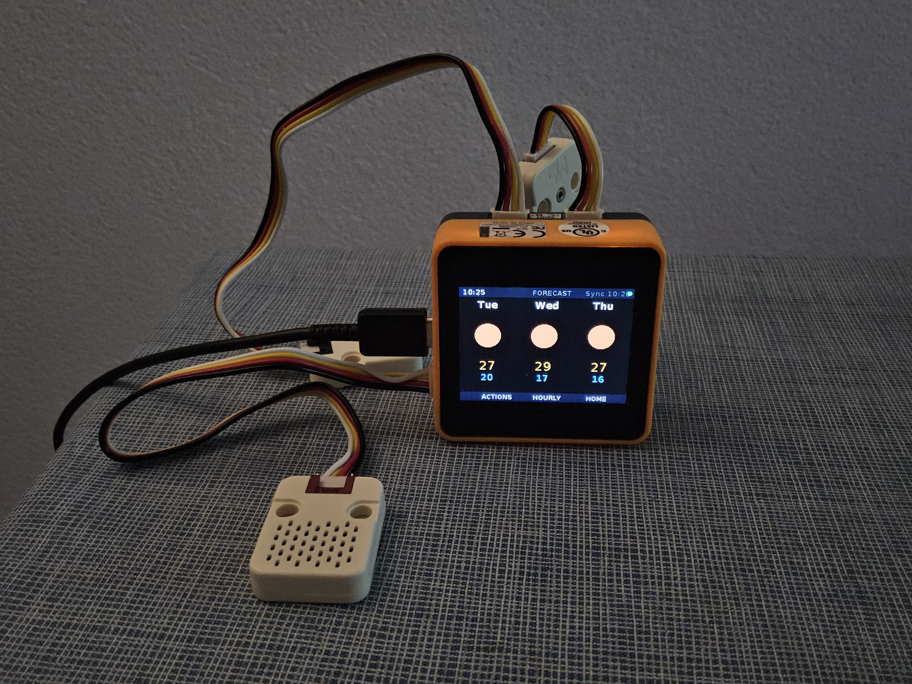
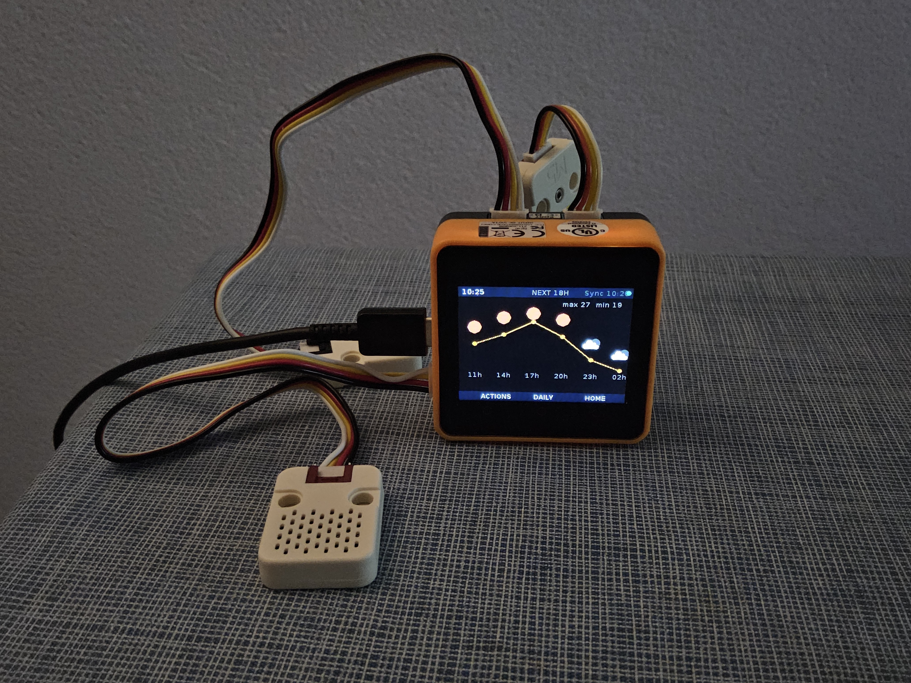
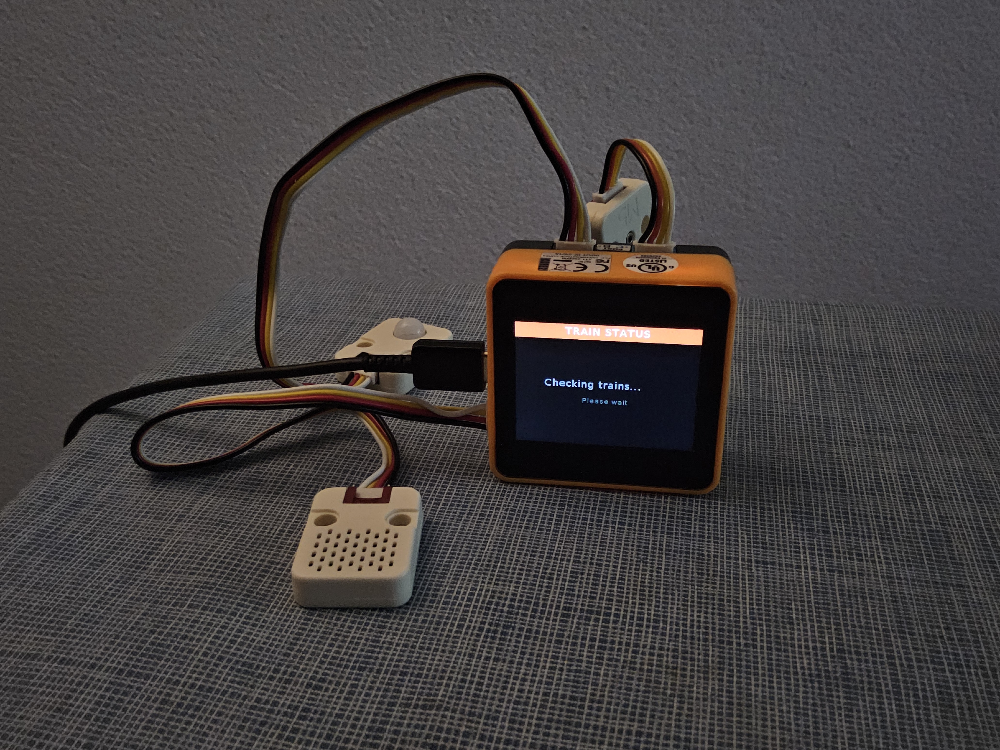
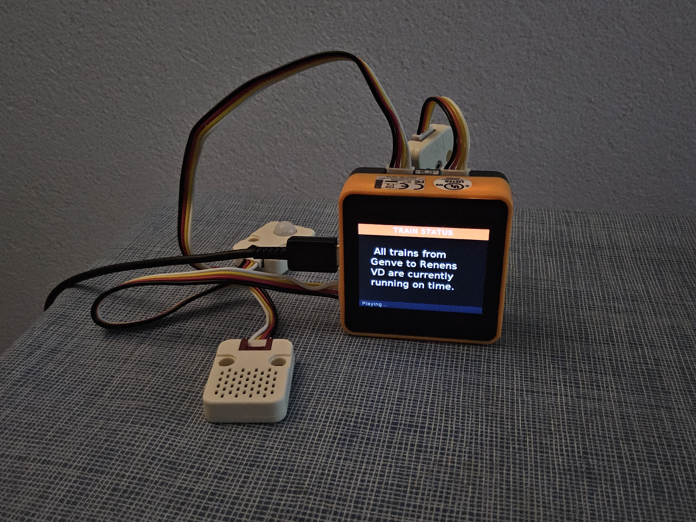

# IoT Weather Station

A three-tier IoT monitoring system: an **M5Stack Core2** device reads indoor air quality and temperature sensors every 5 minutes, a **Flask backend on Cloud Run** enriches the data with live outdoor weather and stores it in BigQuery, and a **Streamlit dashboard on Cloud Run** gives a live view, historical charts, a 5-day forecast, real-time train departures, and an AI voice assistant powered by Gemini.

## Live URLs

| Service               | URL                                                                          |
|-----------------------|------------------------------------------------------------------------------|
| Backend (Flask)       |  **[https://cloud-project-470570889014.europe-west6.run.app](https://cloud-project-470570889014.europe-west6.run.app)**          |
| Dashboard (Streamlit) | **[https://cloud-project-dashboard-470570889014.europe-west6.run.app](https://cloud-project-dashboard-470570889014.europe-west6.run.app)** |

---

## Author

Halim YOUSSEF — 18818153

Gen AI (Claude Code) was used in this assignment for code generation, debugging, and architecture decisions during development.

---

## Features

- **Live indoor monitoring** — temperature, humidity, TVOC, eCO₂ read every 5 minutes from the M5Stack
- **Live outdoor weather** — OpenWeather API enriches every row at insertion time
- **Historical charts** — date-range picker with time-series plots for all sensor channels
- **5-day forecast + hourly chart** — SVG temperature and humidity overlay with weather icons
- **Real-time train departures** — transport.opendata.ch integration with countdown timers, delay badges, and per-leg itinerary
- **AI voice assistant** — Gemini 2.5 Flash answers natural-language questions about sensor history (BigQuery tool-use), live forecast, and train departures; supports microphone input (Google STT) and spoken replies (Google TTS)
- **Proactive announcements** — motion sensor on the M5Stack triggers Gemini-phrased spoken weather, air quality, humidity, or train-delay alerts (with 1-hour cooldown)
- **Dynamic weather UI** — animated rain, snow, sun, clouds, fog, and lightning overlays on the dashboard that respond to live conditions
- **Auth** — SHA-256 password hash on every device→backend call; credentials never in git

---

## Demo

### Video walkthrough

[](https://youtu.be/nOtoQZQ7Z4E)

---

### Dashboard

The Streamlit dashboard runs on Cloud Run and is accessible from any browser. It has five pages:

**Overview** — live indoor metrics (temperature, humidity, TVOC, eCO₂) with quality badges and delta from 1 hour ago, plus live outdoor weather with an animated background that matches current conditions (rain, snow, thunderstorm, etc.).



**Forecast** — 5-day daily cards and an SVG hourly chart with a per-segment temperature colour gradient and a humidity overlay.



**Trains** — live departure board for any Swiss route with countdown timers, delay badges, and expandable per-leg itinerary.



**AI Assistant** — chat interface backed by Gemini 2.5 Flash. Accepts typed questions, microphone input (Google STT), and quick-action buttons that trigger the same proactive announcements as the M5Stack. Spoken replies are played back via Google TTS.



**History** — date-range chart explorer with time-series plots for all four sensor channels and a raw-data table.



---

### M5Stack

The M5Stack Core2 device shows a multi-screen UI driven by physical buttons and a touchscreen. It reads sensors every 5 minutes, sends data to the backend, and plays Gemini-phrased spoken announcements when motion is detected.

**HOME screen** — outdoor icon, temperature, and humidity on the right; indoor strip (temp, humidity, air quality) along the bottom; pulsing motion indicator on the left.



**FORECAST screen** — 3-column daily view (day, icon, max/min temp) switchable to a line chart of the next 6 hourly slots with small icons above each data point.

| Daily view | Hourly chart |
|:---:|:---:|
|  |  |

**TRAINS screen** — scrollable list of the next 5 departures on the Geneva → Renens route with departure time, line, arrival, platform, and a colour-coded delay indicator.


**ACTIONS screen** — 6-button touch grid for manually triggering any announcement type (summary, morning briefing, rain check, air quality, train alert, humidity).


**Announcement screen** — coloured header matching the action type, Gemini-phrased text displayed while the WAV audio plays through the built-in speaker.

|                             Question                             |                              Answer                              |
|:----------------------------------------------------------------:|:----------------------------------------------------------------:|
|    |    |
|          |          |
|  |  |
|        |        |
|      |      |


#### Known limitations and issues encountered

- **Speaker volume is very low.**
  The M5Stack Core2's built-in speaker is extremely quiet — announcements require holding the device next to your ear. Considerable time was spent trying to fix this:
  1. Switched audio format from MP3 to WAV/LINEAR16 (more compatible with the speaker driver)
  2. Bumped the Google TTS `volume_gain_db` from `+6 dB` to `+16 dB` (the API maximum)
  3. Ran an interactive debug cycle testing 7 different playback methods on the device: plain `playWAV`, `setVolume()` on both a 0–10 and a 0–255 scale, direct I2C writes to the speaker amplifier chip, and raw PCM playback bypassing the WAV header entirely
  4. Discovered along the way that the microphone and speaker share the same I2S DAC — a recording attempt corrupts the DAC configuration and causes white noise on the next playback; fixed by reinitializing the speaker before every `playWAV` call
  

 > None of these fully resolved the volume. Our conclusion is that this could be a hardware default of the M5Stack Core2 or that the built-in speaker amplifier simply has a low ceiling (odd considering the booting sound is loud and clear...). An external amplifier or headphone output would be needed for comfortable listening.

- **Microphone input not captured.**
  We tried extensively to record audio from the M5Stack Core2's built-in microphone and send it to Google STT:
  1. **UIFlow `record` module** — the highest-level API; returned empty buffers
  2. **`speaker.record()` / `speaker.startRecord()` + `stopRecord()`** — returned silence; added AXP192 power IC initialization via I2C to ensure the hardware was actually powered — still no signal
  3. **Raw I2S PDM capture** — inspired by [this YouTube video](https://www.youtube.com/watch?v=CwIWpBqa-nM), we directly configured I2S peripheral 0 for PDM receive mode with the microphone pin mapping (`CLK=GPIO0`, `DATA=GPIO34`), with IRQ-based completion and a timeout to avoid hangs
  4. **UIFlow block environment** — tested the microphone directly in UIFlow's visual editor as a baseline sanity check


 > Every attempt produced the same result: `"silent:mic_unav"` or `"signal: 0 SILENT !"` — no audio was captured regardless of the approach. Much like the speaker issue, we suspect this may be a hardware default of this specific device unit rather than a purely software problem. Due to time constraints we moved on; the device triggers announcements via motion detection and the ACTIONS touch menu rather than voice commands.


- **NTP sync is flaky on some UIFlow firmware builds.**
  `ntptime.settime()` silently returns without setting the clock on certain firmware versions. The code falls back to fetching the current time from the backend's `/server-time` endpoint, which resolves the issue in practice.

---

## Architecture

```
┌─────────────────────────────────────────────────────────────────┐
│  TIER 1 — Data Layer                                            │
│  BigQuery (cloud_project.weather-records)                       │
│  OpenWeather API (outdoor conditions)                           │
│  transport.opendata.ch (train departures)                       │
└─────────────────────────────▲──┬────────────────────────────────┘
                              │  │  read / write
┌─────────────────────────────┴─ ▼────────────────────────────────┐
│  TIER 2 — Flask Backend (Cloud Run, europe-west6)               │
│  All external API calls and BigQuery access live here           │
│  Vertex AI Gemini Flash  ·  Google STT  ·  Google TTS           │
└─────┬───▲───────────────────────────────────────┬───────────────┘
      │   │  HTTP POST/GET              HTTP GET  │
┌─────▼───┴───────────┐           ┌───────────────▼─────────────┐
│ TIER 3a — M5Stack   │           │ TIER 3b — Streamlit         │
│ MicroPython device  │           │ Dashboard (Cloud Run)       │
│ Sensors + display   │           │ Read-only web UI            │
└─────────────────────┘           └─────────────────────────────┘
```

| Module | Role |
|--------|------|
| `backend/main.py` | Flask routes — all API endpoints |
| `backend/services/weather.py` | OpenWeather API + forecast parsing + in-memory cache |
| `backend/services/database.py` | BigQuery insert + latest-row query + cache |
| `backend/services/voice.py` | Gemini tool-use loop — BigQuery, forecast, and train tools |
| `backend/services/audio.py` | Google STT transcription + TTS synthesis |
| `backend/services/announcements.py` | Proactive announcement composer (6 action types) |
| `dashboard/app.py` | Streamlit navigation controller (5 pages) |
| `dashboard/utils.py` | Shared BigQuery client, Flask helpers, UI components |
| `dashboard/pages/overview.py` | Live metrics + animated weather overlays |
| `dashboard/pages/forecast.py` | 5-day cards + SVG hourly chart |
| `dashboard/pages/trains.py` | Live departure board with countdowns and itinerary |
| `dashboard/pages/voice.py` | AI assistant chat + quick actions + mic input |
| `dashboard/pages/history.py` | Date-range chart explorer |
| `m5stack/m5stack.py` | MicroPython — sensors, display, motion, announcements |

**BigQuery table:** `YOUR_GCP_PROJECT_ID.cloud_project.weather-records`  
Schema: `date, time, indoor_temp, indoor_humidity, air_quality_tvoc, air_quality_eco2, outdoor_temp, outdoor_humidity, outdoor_weather`

---

## Prerequisites

- Python 3.12+
- A GCP project with the following APIs enabled:
  - BigQuery
  - Vertex AI
  - Cloud Speech-to-Text
  - Cloud Text-to-Speech
  - Cloud Run + Cloud Build (for deployment)
- A GCP service account key JSON placed at the project root as `gcp-key.json` (for local dev only — Cloud Run uses its attached service account automatically)
- An [OpenWeather](https://openweathermap.org/api) API key (free tier)
- M5Stack Core2 with ENV III (PORTA), PIR (PORTB), and TVOC (PORTC) units attached

---

## Environment variables

### Backend

| Variable | Required | Default | Description |
|----------|:--------:|---------|-------------|
| `PASSWORD_HASH` | ✅ | — | SHA-256 hash of your chosen password |
| `OPENWEATHER_API_KEY` | ✅ | — | OpenWeather API key |
| `CITY` | — | `Genève` | City for outdoor weather |
| `TZ_OFFSET_HOURS` | — | `2` | Local UTC offset (e.g. `2` for CEST) |
| `GCP_PROJECT` | — | `YOUR_GCP_PROJECT_ID` | GCP project ID |
| `GCP_LOCATION` | — | `europe-west1` | Vertex AI region |
| `TRAIN_FROM` | — | `Genève` | Default departure station |
| `TRAIN_TO` | — | `Renens VD` | Default arrival station |

### Dashboard

| Variable | Required | Description |
|----------|:--------:|-------------|
| `PASSWORD_HASH` | ✅ | Same hash as the backend |
| `FLASK_URL` | ✅ | Backend Cloud Run URL |

**Generating the password hash** (run once, in any Python shell):
```python
import hashlib
print(hashlib.sha256(b"your-chosen-password").hexdigest())
```

---

## Local setup

### Option A — Python (no Docker)

Run each service in a separate terminal. Both need your GCP credentials:

```bash
export GOOGLE_APPLICATION_CREDENTIALS="./gcp-key.json"
```

**Terminal 1 — Backend:**
```bash
cd backend
pip install -r requirements.txt
export PASSWORD_HASH="<your-sha256-hash>"
export OPENWEATHER_API_KEY="<your-openweather-key>"
python main.py
# API available at http://localhost:8080
```

**Terminal 2 — Dashboard:**
```bash
cd dashboard
pip install -r requirements.txt
export PASSWORD_HASH="<your-sha256-hash>"
export FLASK_URL="http://localhost:8080"
streamlit run app.py
# Opens at http://localhost:8501
```

### Option B — Docker (each service separately)

**Backend:**
```bash
docker build -t iot-backend ./backend
docker run -p 8080:8080 \
  -e PASSWORD_HASH="<your-sha256-hash>" \
  -e OPENWEATHER_API_KEY="<your-openweather-key>" \
  -v "$PWD/gcp-key.json:/app/gcp-key.json" \
  -e GOOGLE_APPLICATION_CREDENTIALS="/app/gcp-key.json" \
  iot-backend
```

**Dashboard:**
```bash
docker build -t iot-dashboard ./dashboard
docker run -p 8501:8501 \
  -e PASSWORD_HASH="<your-sha256-hash>" \
  -e FLASK_URL="http://localhost:8080" \
  -v "$PWD/gcp-key.json:/app/gcp-key.json" \
  -e GOOGLE_APPLICATION_CREDENTIALS="/app/gcp-key.json" \
  iot-dashboard
```

| Service | URL |
|---------|-----|
| Backend (Flask) | http://localhost:8080 |
| Dashboard (Streamlit) | http://localhost:8501 |

---

## M5Stack setup

The device runs MicroPython via UIFlow. No compilation needed — paste and run.

1. Flash the M5Stack Core2 with UIFlow firmware using **M5Burner** (download from [m5stack.com](https://m5stack.com))
2. Configure WiFi credentials in M5Burner — they are stored on the device at firmware level; the Python code does not contain them
3. Open **[flow.m5stack.com](https://flow.m5stack.com)** and connect your device
4. Switch to **Python mode** (the `</>` tab)
5. Open `m5stack/m5stack.py` and update the two constants at the top:
   ```python
   FLASK_URL     = "https://YOUR_BACKEND_URL.run.app"
   PASSWORD_HASH = "<your-sha256-hash>"   # same hash as the backend
   ```
6. Paste the full file into UIFlow and click **Run**

The device will connect to WiFi, sync its clock via NTP, load the last known readings from BigQuery, and start the main loop. Sensors send data every 5 minutes; motion triggers announcements with a 1-hour cooldown between 06:00–11:00.

---

## GCP Cloud Shell deployment

All commands run in **Cloud Shell** (the `>_` button in the GCP Console).

### 0. Initial setup

```bash
gcloud config set project YOUR_GCP_PROJECT_ID
gcloud config set run/region europe-west6

# Clone the repo (skip if already present)
git clone https://github.com/<your-username>/<repo>.git
cd <repo>
```

Set your credentials as shell variables (used in the deploy commands below):
```bash
export PASSWORD_HASH="<your-sha256-hash>"
export OPENWEATHER_API_KEY="<your-openweather-key>"
```

> **Service account note:** Cloud Run uses the default Compute Engine SA automatically. It needs BigQuery, Vertex AI, Speech, and Text-to-Speech access. On most new GCP projects the default SA has the `Editor` role and no extra steps are needed. If you get 403 errors after deploying, check the SA's roles in IAM and grant the missing ones.

### 1. Deploy the backend

```bash
gcloud run deploy cloud-project \
  --source ./backend \
  --region europe-west6 \
  --allow-unauthenticated \
  --set-env-vars "PASSWORD_HASH=$PASSWORD_HASH,OPENWEATHER_API_KEY=$OPENWEATHER_API_KEY,CITY=Genève,TZ_OFFSET_HOURS=2,GCP_LOCATION=europe-west1"
```

First build takes ~2–3 minutes. When it finishes, smoke-test the endpoint:
```bash
curl https://YOUR_BACKEND_URL.run.app/
# Expected: {"service":"IoT Weather Backend","status":"ok"}
```

### 2. Deploy the dashboard

```bash
gcloud run deploy cloud-project-dashboard \
  --source ./dashboard \
  --region europe-west6 \
  --allow-unauthenticated \
  --session-affinity \
  --set-env-vars "PASSWORD_HASH=$PASSWORD_HASH,FLASK_URL=https://YOUR_BACKEND_URL.run.app"
```

`--session-affinity` is required — Streamlit stores chat state in memory per instance, so requests from the same browser session must reach the same container.

If the dashboard OOMs on startup, add `--memory 1Gi`.

### 3. Verify

| Test | Expected result |
|------|-----------------|
| `curl <backend-url>/` | `{"status":"ok"}` |
| Dashboard → Overview | Live indoor + outdoor readings, green freshness dot |
| AI Assistant → type "what's the indoor temperature?" | Spoken sentence answer in ~3 s |
| AI Assistant → 🎤 record → ⏹ | Transcript + spoken reply in ~6 s |
| Quick actions → Current summary | Announcement bubble + audio playback |

View logs if anything fails:
```bash
gcloud run services logs read cloud-project           --limit 50
gcloud run services logs read cloud-project-dashboard --limit 50
```

### 4. Redeploying after a code change

```bash
gcloud run deploy cloud-project           --source ./backend
gcloud run deploy cloud-project-dashboard --source ./dashboard
```

Env vars persist on the service — omit `--set-env-vars` unless something changed.

To update a single variable without rebuilding:
```bash
gcloud run services update cloud-project --update-env-vars TZ_OFFSET_HOURS=1
```

---

## Common gotchas

| Symptom | Cause | Fix |
|---------|-------|-----|
| `RuntimeError: PASSWORD_HASH env var is required` at startup | `--set-env-vars` missing or misspelled | Re-deploy with the flag |
| 403 PermissionDenied on Vertex AI / BigQuery / Speech | Cloud Run SA missing the role | Grant `Editor` (or specific roles) in IAM |
| Dashboard chat resets between messages | `--session-affinity` flag missing | Re-deploy with it |
| Cold start of ~10 s on first request | Cloud Run scales to zero | Add `--min-instances 1` to prevent (costs more) |
| M5Stack screen blank at boot | Backend unreachable before first fetch completes | Normal — wait ~10 s; device shows last known data after connecting |

---

## Next steps

Things we would tackle with more time:

- **Investigate the correct I2C targets for speaker and microphone.** During debugging we attempted to control the speaker amplifier and microphone hardware via direct I2C writes, but we may have been targeting the wrong chip addresses. Cross-referencing the actual M5Stack Core2 hardware pinout more carefully — and confirming which chip sits at which I2C address — could unlock both louder audio and working microphone capture without any other code changes.
- **M5Stack microphone input.** The full STT → Gemini → TTS loop already works on the dashboard. Bringing it to the device would make the assistant truly hands-free. Resolving the correct I2C target (see above) is likely the first step.
- **Louder speaker output.** Once the correct amplifier control path is confirmed, re-running the volume debug cycle with accurate chip registers could push the volume well above its current ceiling.
- **Push notifications.** Send a mobile alert (e.g. via Pushover or ntfy) when air quality drops or an unusual temperature spike is detected, so the system can flag issues even when nobody is watching the dashboard.
- **7-day forecast.** The free OpenWeather tier caps at 5 days. Subscribing to the OneCall API 3.0 free tier (requires a credit card for verification) would unlock a full week.

---

## Quick reference

| Resource          | Value                                                     |
|-------------------|-----------------------------------------------------------|
| GCP project       | `YOUR_GCP_PROJECT_ID`                                     |
| Cloud Run region  | `europe-west6`                                            |
| Vertex AI region  | `europe-west1`                                            |
| Backend service   | `cloud-project`                                           |
| Backend URL       | `https://YOUR_BACKEND_URL.run.app`                        |
| Dashboard service | `cloud-project-dashboard`                                 |
| BigQuery table    | `YOUR_GCP_PROJECT_ID.cloud_project.weather-records`       |
